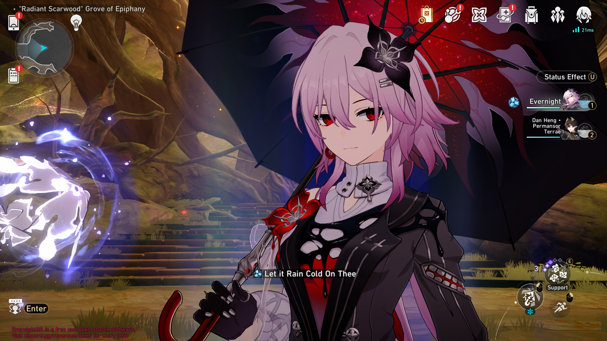

# EvernightSR
#### Honkai: Star Rail server emulator (3.6 beta) written in Zig.



## Requirements
[Zig 0.14.1 x64](https://ziglang.org/download/0.14.1/zig-x86_64-windows-0.14.1.zip)

## Running

### Setup launcher.exe

Copy and paste launcher.exe and hkprg.dll from [launcher folder](https://git.xeondev.com/HonkaiSlopRail/evernight-sr/src/branch/master/launcher) inside evernight-sr to `client folder`.

### From source

Windows:
```
git clone https://git.xeondev.com/HonkaiSlopRail/evernight-sr
cd evernight-sr
zig build run-dispatch
zig build run-gameserver
```
Then open your `launcher.exe` with administrator.

### Using Pre-built Binaries
Navigate to the [Releases](https://git.xeondev.com/HonkaiSlopRail/evernight-sr/releases)
page and download the latest release for your platform.

## Connecting
[Get 3.5.51 CN client](https://gofile.io/d/ET5tF8) or [mirror link](https://transfer.it/t/dQY1fBpXQBJa)

## Functionality (work in progress)
- Login and player spawn
- Test battle via calyx
- MOC/PF/AS simulator with custom stage sellection
- Anomaly Arbitration (Challenge Peak)
- Gacha simulator 
- Support command for Sillyism
## Contributing

Pull requests are welcome. For major changes, please open an issue first to discuss
what you would like to change, and why.

## Bug Reports

If you find a bug, please open an issue with as much detail as possible. If you
can, please include steps to reproduce the bug.

Bad issues such as "This doesn't work" will be closed immediately, be _sure_ to
provide exact detailed steps to reproduce your bug. If it's hard to reproduce, try
to explain it and write a reproducer as best as you can.